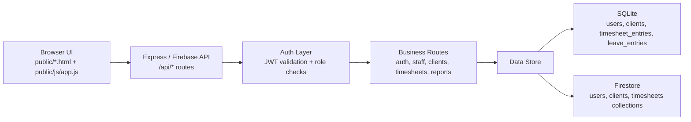
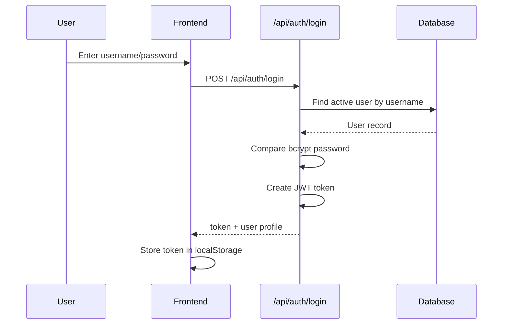
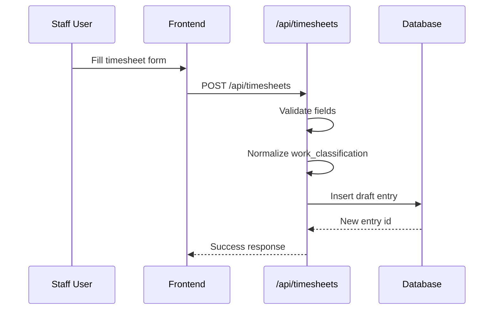
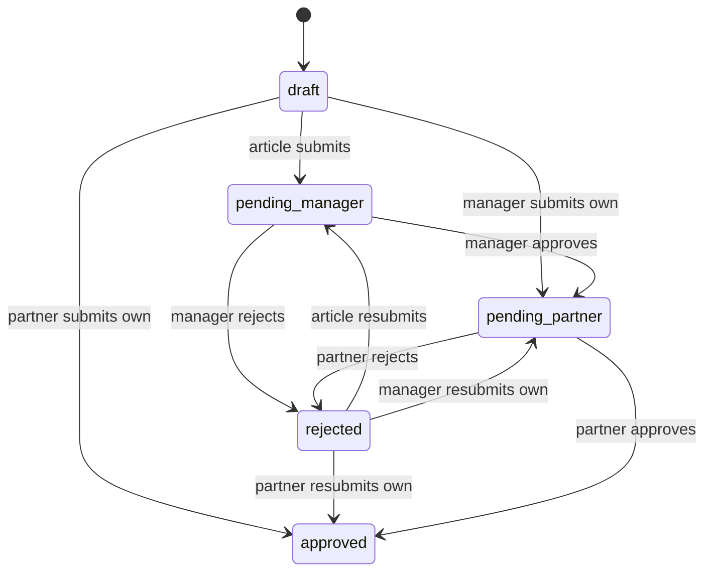
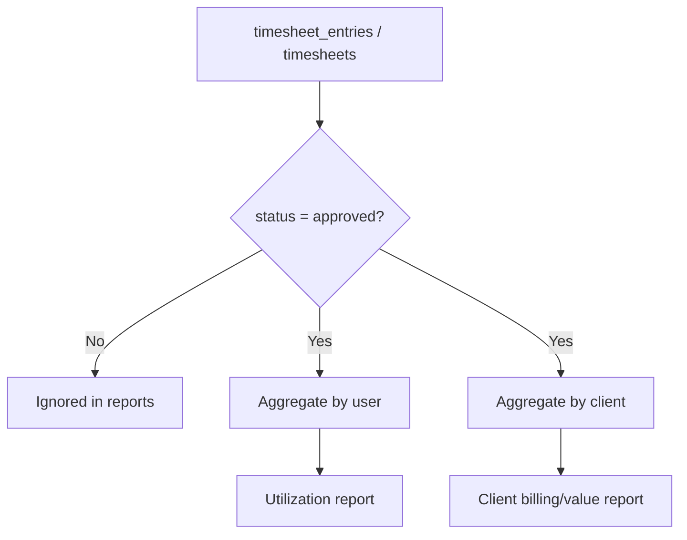
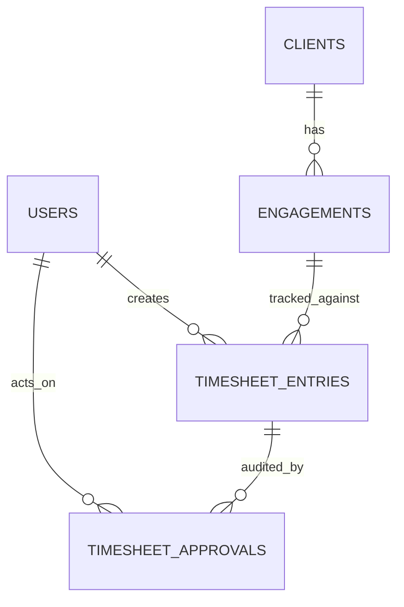

# Database Architecture Design

## 1. Purpose

This project is a **timesheet and approval system** for a CA practice.

The current codebase supports **two storage backends**:

- **Local development:** Express API + SQLite (`data/timesheet.db`)
- **Cloud deployment:** Firebase Functions + Firestore

Both backends follow the same business flow:

1. User logs in
2. User creates timesheet entries
3. Entries move through role-based approval
4. Approved entries feed reports and summaries

---

## 2. High-Level Architecture



---

## 3. Core Data Model

### Main entities

- `users`: people who use the system
- `clients`: clients for whom work is performed
- `timesheet_entries`: daily work logs and approval records
- `leave_entries`: leave records in SQLite only

### Entity relationship view

```mermaid
erDiagram
    USERS ||--o{ TIMESHEET_ENTRIES : creates
    CLIENTS ||--o{ TIMESHEET_ENTRIES : belongs_to
    USERS ||--o{ LEAVE_ENTRIES : takes
    USERS ||--o{ TIMESHEET_ENTRIES : manager_approves
    USERS ||--o{ TIMESHEET_ENTRIES : partner_approves

    USERS {
        int id PK
        string name
        string username UNIQUE
        string password
        string role
        string designation
        string department
        int active
        datetime created_at
    }

    CLIENTS {
        int id PK
        string name
        string code UNIQUE
        string contact_person
        string email
        string phone
        float billing_rate
        int active
        datetime created_at
    }

    TIMESHEET_ENTRIES {
        int id PK
        int user_id FK
        int client_id FK
        date entry_date
        string task_type
        string description
        string start_time
        string end_time
        float hours
        string work_classification
        int billable
        string status
        string rejection_reason
        int approved_by_manager FK
        int approved_by_partner FK
        datetime created_at
        datetime updated_at
    }

    LEAVE_ENTRIES {
        int id PK
        int user_id FK
        date leave_date
        string leave_type
        string reason
        datetime created_at
    }
```

---

## 4. Database Structure by Backend

### 4.1 SQLite structure

SQLite is initialized in [`js/database.js`](/E:/AI Projects/Timesheet/js/database.js).

Tables:

- `users`
- `clients`
- `timesheet_entries`
- `leave_entries`

Important relational links:

- `timesheet_entries.user_id -> users.id`
- `timesheet_entries.client_id -> clients.id`
- `timesheet_entries.approved_by_manager -> users.id`
- `timesheet_entries.approved_by_partner -> users.id`
- `leave_entries.user_id -> users.id`

Why this works well:

- strong for local development
- simple SQL reporting with `SUM`, `GROUP BY`, and joins
- easy to seed demo users and clients

### 4.2 Firestore structure

Firestore is initialized in [`functions/db.js`](/E:/AI Projects/Timesheet/functions/db.js).

Collections:

- `users`
- `clients`
- `timesheets`

Document references are stored as plain IDs, for example:

- `timesheets.user_id`
- `timesheets.client_id`

Because Firestore does not support SQL-style joins and aggregations directly, reports are built by:

1. reading users/clients into memory
2. reading timesheet documents
3. combining and aggregating values in application code

This is visible in [`functions/routes/reports.js`](/E:/AI Projects/Timesheet/functions/routes/reports.js).

---

## 5. Request and Data Flow

### 5.1 Authentication flow



Key files:

- [`routes/auth.js`](/E:/AI Projects/Timesheet/routes/auth.js)
- [`public/js/app.js`](/E:/AI Projects/Timesheet/public/js/app.js)

---

### 5.2 Timesheet creation flow



Stored business fields:

- who did the work: `user_id`
- when: `entry_date`
- for whom: `client_id`
- what work: `task_type`, `description`
- duration: `start_time`, `end_time`, `hours`
- category: `work_classification`, `billable`
- workflow state: `status`

---

### 5.3 Approval flow

This is the most important business process in the system.

### Role path

- `article` submits to manager
- `manager` submits own entries directly to partner
- `partner` can self-approve own entries

### Status lifecycle



Approval audit fields:

- `approved_by_manager`
- `approved_by_partner`
- `rejection_reason`
- `updated_at`

Main route logic:

- submit: [`routes/timesheets.js`](/E:/AI Projects/Timesheet/routes/timesheets.js)
- review: [`routes/timesheets.js`](/E:/AI Projects/Timesheet/routes/timesheets.js)

---

## 6. Reporting Flow

Reports only use **approved** entries for utilization and client reporting.



Current report outputs:

- staff utilization
- client-wise hours
- CSV export of detailed entries
- staff hours summary

Source files:

- [`routes/reports.js`](/E:/AI Projects/Timesheet/routes/reports.js)
- [`routes/staff.js`](/E:/AI Projects/Timesheet/routes/staff.js)

---

## 7. Flow of Each Module

### 7.1 Staff module

- reads from `users`
- partner creates/updates staff
- manager/partner can view staff list
- approved timesheet data is aggregated for hour summaries

### 7.2 Client module

- reads/writes `clients`
- partner manages client master data
- timesheet entries optionally link to a client
- billing reports use `billing_rate * approved client_work hours`

### 7.3 Timesheet module

- main transactional module
- inserts and updates `timesheet_entries`
- enforces ownership and approval status rules
- acts as the source for dashboard stats and reports

### 7.4 Reports module

- read-only aggregation layer
- depends on `users`, `clients`, and approved timesheet data

---

## 8. Practical Flow Example

Example: article user logs 6 hours for Client A

1. User logs in and receives JWT
2. User creates a record in `timesheet_entries` with `status = draft`
3. User submits entry
4. Entry becomes `pending_manager`
5. Manager approves it
6. Entry becomes `pending_partner`
7. Partner approves it
8. Entry becomes `approved`
9. Utilization and client reports now include those 6 hours

---

## 9. Architecture Notes and Gaps

### What is good in the current design

- clean separation between routes and persistence
- approval workflow is explicit in the data model
- reporting rules are easy to understand
- SQLite version is good for fast local development

### Current limitations

- JWT secret is hardcoded
- no separate approval history table; only latest approver fields are stored
- `leave_entries` exists in SQLite but is not yet integrated into reporting flow
- Firestore reporting is less efficient because joins/aggregations are done in code
- there is no dedicated `departments`, `projects`, or `engagements` table yet

---

## 10. Recommended Future Database Architecture

If this system grows, a more scalable relational design would be:

- `users`
- `roles`
- `clients`
- `engagements`
- `projects`
- `timesheet_entries`
- `timesheet_approvals`
- `leave_entries`
- `departments`

Recommended improvement:

- move approval history into a separate `timesheet_approvals` table
- keep `timesheet_entries.status` as current state only
- store every approval/rejection action as an event row

That would make audit and compliance reporting much stronger.

Example:



---

## 11. Simple Mental Model

You can think of the system like this:

- `users` = who is working
- `clients` = for whom the work is done
- `timesheet_entries` = what work happened
- `status` = where that work is in approval
- `reports` = summaries built only from approved work

So the main flow is:

**User -> Timesheet Entry -> Approval -> Approved Data -> Reports**
